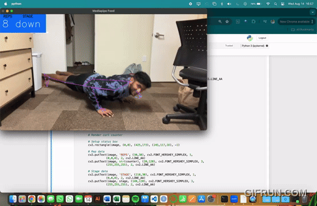

# AI-Pushup-Tracker-Using-MediaPipe-Pose-Estimator

### Developed an AI Pose Tracker using Mediapipe and OpenCV to track body landmarks and count pushups in real-time via webcam

This approach tracks pushup counts by analyzing angle changes at the shoulder, elbow, and wrist, and displays real-time feedback on the number of completed pushups and the current exercise stage. This adaptation effectively utilizes pose estimation techniques for personalized fitness tracking. This adaptation allows for monitoring of exercise form and count.

This is the pushup tracker demo.  
Feel free to click the link below to see the demo in youtube:

https://www.youtube.com/watch?v=2LgVWP1C_Zs